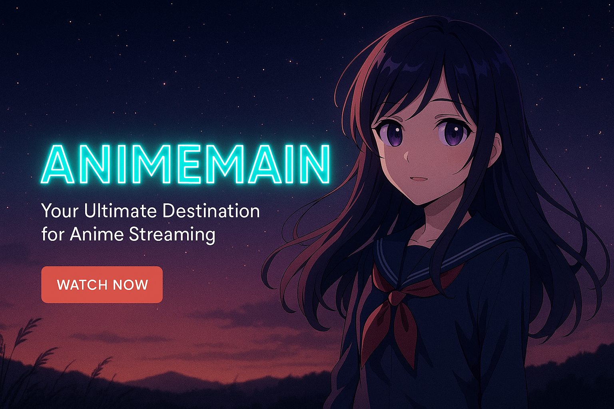

# 🌸 Animemain – Anime Streaming Platform 

<!-- 🚀 High-Impact GitHub Banner -->

  

<!--  -->

**Animemain** is a dynamic, full-stack web application designed for anime enthusiasts to explore, stream, and manage anime content online. With an intuitive user interface, the platform allows users to browse anime by categories, search for specific titles, and view detailed information including episodes and descriptions.

---

## 🚀 Features

- 🎨 **Responsive Design** – Seamless experience across devices
- 🔍 **Instant Search** – Quickly find your favorite anime titles
- 🗂️ **Categorized Listings** – Browse by genre, popularity, or release date
- 📄 **Detailed Anime Pages** – Comprehensive information with episodes and descriptions
- 🔐 **User Authentication** – Secure login and registration system
- 🛠️ **Admin Panel** – Manage content and users efficiently
- 🌙 **Dark Mode** – Eye-friendly viewing experience

---

## 🧰 Tech Stack

### Frontend
- HTML5, CSS3, SCSS
- JavaScript (Vanilla & jQuery)
- Bootstrap 5
- Font Awesome (Icons)

### Backend
- PHP 8+
- MySQL

---

## 📁 Project Structure

Click to expand

      Animemain-Streaming-Platform/
      ├── admin/                      # Admin dashboard for managing content and users
      │   ├── manage_anime.php        # CRUD operations for anime content
      │   ├── manage_users.php        # User management
      │   └── dashboard.php           # Admin overview and reports
      ├── assets/                     # Static frontend assets
      │   ├── css/                    # CSS and SCSS files
      │   ├── js/                     # JavaScript and AJAX scripts
      │   ├── images/                 # Images (thumbnails, banners, logos)
      │   └── fonts/                  # Web fonts
      ├── auth/                       # User authentication system
      │   ├── login.php               # Login page and logic
      │   ├── register.php            # Registration page
      │   ├── logout.php              # Logout script
      │   └── password_reset.php      # Password recovery/reset
      ├── config/                     # Configuration files
      │   └── config.php              # Database credentials and constants
      ├── includes/                   # Reusable PHP components & utilities
      │   ├── header.php              # Common header markup
      │   ├── footer.php              # Common footer markup
      │   ├── db_connect.php          # Database connection setup
      │   ├── functions.php           # Helper functions
      │   └── session_manager.php     # Session handling and user validation
      ├── pages/                      # Main frontend pages
      │   ├── categories.php          # Anime categories listing
      │   ├── anime_details.php       # Detailed anime and episodes
      │   ├── watch.php               # Streaming/player page
      │   └── profile.php             # User profile and settings
      ├── uploads/                    # Uploaded media files
      │   ├── thumbnails/             # Anime thumbnail images
      │   └── videos/                 # Video files for streaming
      ├── search.php                  # Search functionality
      ├── index.php                   # Homepage
      ├── database.sql                # SQL database setup script
      ├── .htaccess                   # Apache configuration (rewrite rules, security)
      ├── README.md                   # Project documentation
      └── LICENSE                    # License information

---

## 📸 Screenshots

> ✨ Key UI pages of the blog platform

---

### 🎬 Categories Page  

  

---

### 🏠 Home Dashboard  

  

---

### 👤 User Profile  

  

---

### 🔐 Login Page  

  

---

### 📝 Register Page  

  

---

## 🛠️ Installation & Setup

### 1. Clone the Repository

      git clone https://github.com/bhaktofmahakal/Animemain-Streaming-Platform.git

---

🙌 Acknowledgements

Inspired by the needs of modern anime fans 🌸

Special thanks to open-source creators, icon libraries, and anime APIs

---

“The world isn’t perfect. But it’s there for us, trying the best it can. That’s what makes it so damn beautiful.”

— Roy Mustang, Fullmetal Alchemist: Brotherhood

---

  
  
  
  
  

---

